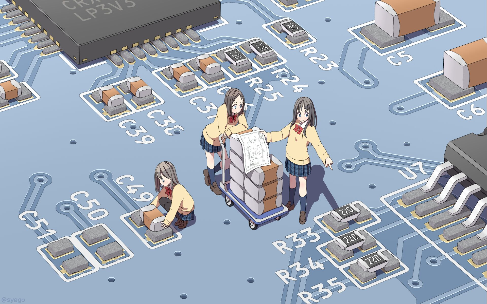

  <h1>Welcome(◍˃̶ᗜ˂̶◍)✩</h1>
  I mainly use Golang, C, Asm, Kotlin and Python.  

  
  
  

---

  <h3>冬祭</h3>
  冬节至，四时清。朔风上，天籁临。 征人鼙鼓，异域飞襟。银河浩渺，古今无垠。 星流指先落，月曜空际灵。浩茫沧海没，桑田又曾经。 未来青空千代，明日梨花仙台。千载何方归梦，棹舟星河波开。 光年计亿先吾路，航迹星白风失途。举目茫茫不知处，长歌漫漫可当哭。  

---
